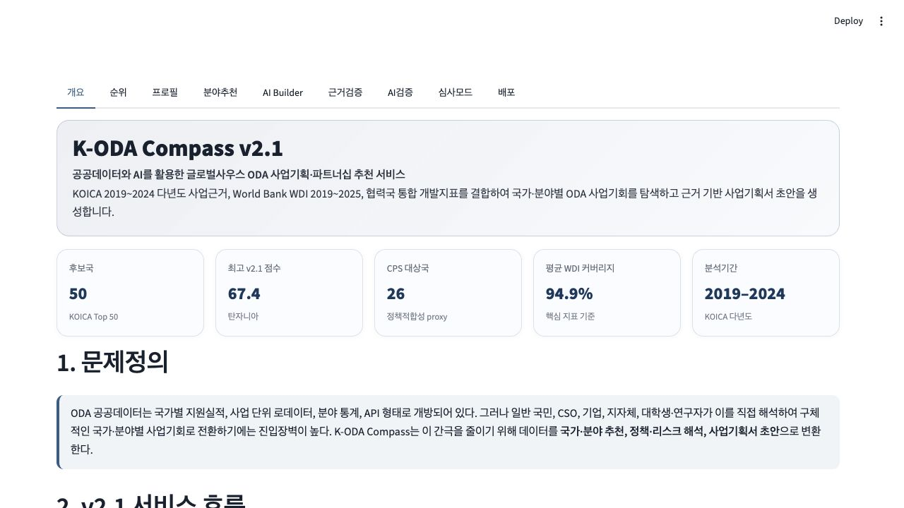
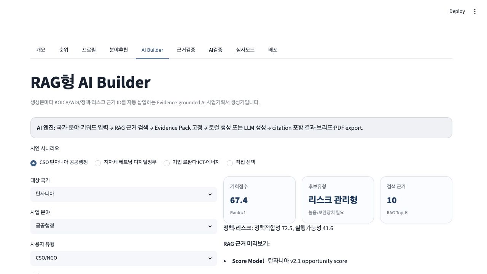
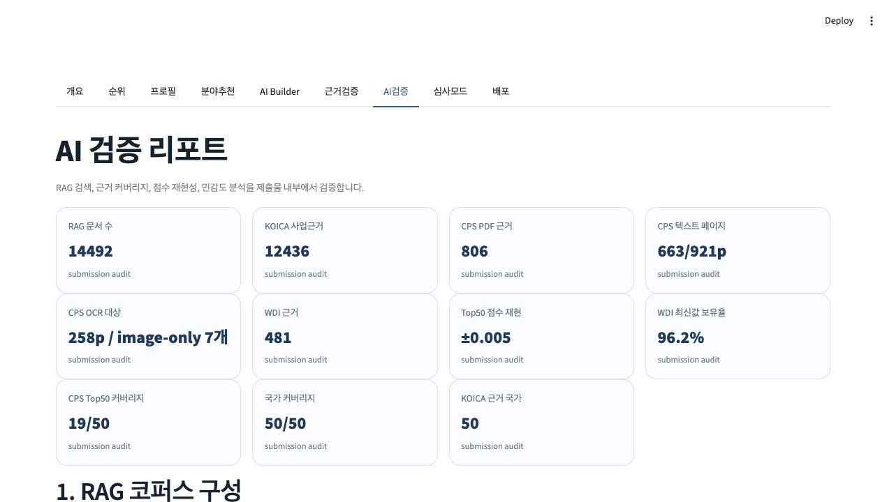
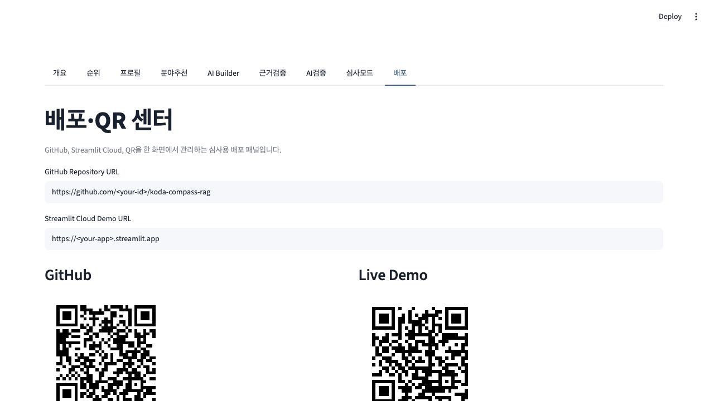

# Project Completion Walkthrough

K-ODA Compass RAG was completed as a deployable public-data AI decision-support service rather than a static dashboard. The final package connects country ranking, risk-adjusted scoring, CPS policy evidence, RAG proposal generation, validation, PDF outputs, and deployment handoff.

## 1. Service Overview

The first screen frames the project as an ODA opportunity and partnership recommendation service. It shows the Top 50 country universe, highest v2.1 score, CPS target signal, WDI coverage, and analysis period so judges immediately see data scope and decision value.

## 2. RAG AI Builder

The AI Builder turns a user scenario into a grounded proposal workflow. It retrieves KOICA, WDI, policy/risk, and CPS PDF evidence before generation, then inserts evidence IDs such as `[E01]` into the generated proposal, policy brief, evidence pack, and PDF exports.

## 3. Validation Layer

The AI validation screen was added to make the model auditable. It exposes RAG document count, KOICA evidence count, CPS PDF chunks, CPS readable text pages, OCR target pages, WDI coverage, Top 50 score reproducibility, country coverage, and sensitivity analysis.

## 4. Deployment and QR Center

The deployment screen is ready for the final GitHub and Streamlit Cloud URLs. Once the repository URL and Streamlit URL are available, the app can generate QR codes for the live demo and source repository.

## Final Completion Actions

1. Added `KODA_cps_pdf_ocr_coverage.csv` and `docs/cps_ocr_coverage.md` to make CPS text/OCR coverage explicit.
2. Added `scripts/ocr_cps_pdfs.py` so image-only CPS PDFs can be OCR-processed when Tesseract Korean OCR is available.
3. Added `scripts/verify_llm_call.py` and `docs/llm_verification_result.md` to record actual OpenAI Responses API verification when `OPENAI_API_KEY` is provided.
4. Regenerated proposal and policy brief PDFs with Korean font embedding for reliable rendering.
5. Added service-style case study PDFs for CSO, local-government, and company use cases.
6. Added `docs/final_deployment_handoff.md` for GitHub push, Streamlit Cloud deployment, secrets, and QR updates.

## Remaining External Dependencies

- GitHub repository URL or login access
- Streamlit Cloud login access
- Optional OpenAI API key for the final live LLM verification capture
